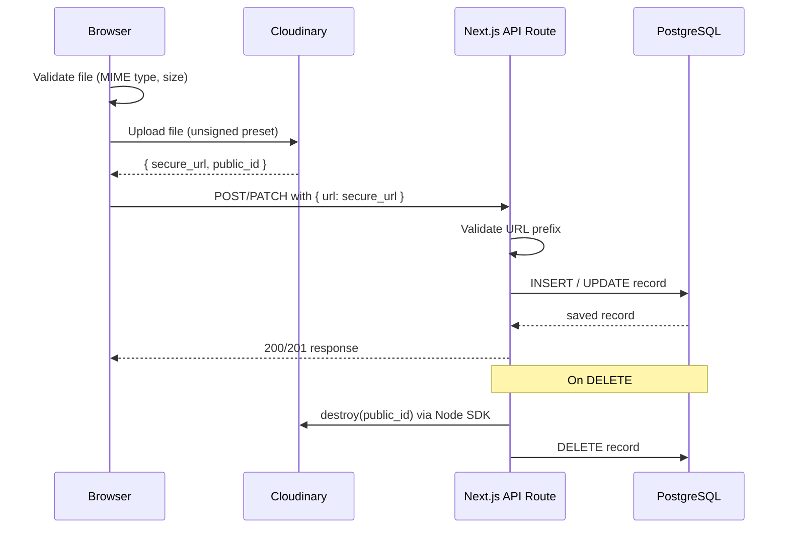

# Design Document: Media Upload

## Overview

This feature adds media upload capabilities to the Ethiopian Football League Management System. The architecture follows a **client-direct-to-Cloudinary** pattern: the browser uploads files directly to Cloudinary using unsigned upload presets, then sends the resulting Cloudinary URL to a Next.js API route which persists it to the database. No file bytes pass through the Next.js server.

Deletion is handled server-side: when a media record or its parent entity is deleted, the API calls the Cloudinary Destroy API using the `cloudinary` Node SDK before removing the database record.

### Key Design Decisions

- **`next-cloudinary`** for client-side upload widgets (wraps the Cloudinary Upload Widget).
- **`cloudinary` Node SDK** for server-side destroy calls only.
- **Unsigned uploads** with entity-specific upload presets — no signed upload tokens needed.
- **URL validation** on every API write: only URLs beginning with `https://res.cloudinary.com/` are accepted.
- **Cascade cleanup**: gallery records use Prisma `onDelete: Cascade` for DB cleanup; Cloudinary cleanup is handled explicitly in API route DELETE handlers and parent-entity DELETE handlers.

---

## Architecture



### Upload Preset Mapping

| Entity | Upload Preset Env Var | Preset Name (example) |
|---|---|---|
| User profile photo | `NEXT_PUBLIC_CLOUDINARY_UPLOAD_PRESET_USER_PROFILE` | `user_profile` |
| Organization logo | `NEXT_PUBLIC_CLOUDINARY_UPLOAD_PRESET_ORG_LOGO` | `org_logo` |
| League logo | `NEXT_PUBLIC_CLOUDINARY_UPLOAD_PRESET_LEAGUE_LOGO` | `league_logo` |
| Club logo | `NEXT_PUBLIC_CLOUDINARY_UPLOAD_PRESET_CLUB_LOGO` | `club_logo` |
| Club gallery | `NEXT_PUBLIC_CLOUDINARY_UPLOAD_PRESET_CLUB_GALLERY` | `club_gallery` |
| Stadium gallery | `NEXT_PUBLIC_CLOUDINARY_UPLOAD_PRESET_STADIUM_GALLERY` | `stadium_gallery` |
| Player photo | `NEXT_PUBLIC_CLOUDINARY_UPLOAD_PRESET_PLAYER_PHOTO` | `player_photo` |
| Coach photo | `NEXT_PUBLIC_CLOUDINARY_UPLOAD_PRESET_COACH_PHOTO` | `coach_photo` |
| Match media | `NEXT_PUBLIC_CLOUDINARY_UPLOAD_PRESET_MATCH_MEDIA` | `match_media` |

---

## Components and Interfaces

### Client Components

#### `MediaUploadWidget` (reusable)

A thin wrapper around `next-cloudinary`'s `CldUploadWidget`. Accepts:

```typescript
interface MediaUploadWidgetProps {
  uploadPreset: string;          // env var value for the entity type
  onSuccess: (url: string) => void;
  onError?: (error: unknown) => void;
  accept: "image" | "image+video";
  maxFileSizeMb: number;         // 5 for images, 100 for video
  children: React.ReactNode;     // trigger button
}
```

Client-side validation (MIME type and size) is enforced via the `clientAllowedFormats` and `maxFileSize` options passed to the Cloudinary widget config. The `onSuccess` callback receives the `secure_url` from the Cloudinary response.

#### `SinglePhotoUpload`

Wraps `MediaUploadWidget` for single-URL entities (user profile, org logo, league logo, club logo, player `photoUrl`, coach `photoUrl`). On success, calls the appropriate PATCH endpoint with `{ photoUrl }` or `{ logoUrl }`.

#### `GalleryUpload`

Wraps `MediaUploadWidget` for gallery entities (ClubImage, StadiumImage, PlayerImage, CoachImage, MatchMedia). On success, calls the appropriate POST endpoint. Renders existing gallery items with delete buttons.

### Server-Side Utilities

#### `lib/cloudinary.ts`

```typescript
import { v2 as cloudinary } from "cloudinary";

cloudinary.config({
  cloud_name: process.env.NEXT_PUBLIC_CLOUDINARY_CLOUD_NAME,
  api_key: process.env.CLOUDINARY_API_KEY,
  api_secret: process.env.CLOUDINARY_API_SECRET,
});

export function extractPublicId(cloudinaryUrl: string): string {
  // Extracts the public_id from a Cloudinary secure_url
  // e.g. https://res.cloudinary.com/<cloud>/image/upload/v123/folder/file.jpg
  //   -> folder/file (without extension)
}

export async function destroyAsset(publicId: string): Promise<void> {
  await cloudinary.uploader.destroy(publicId);
}

export const CLOUDINARY_URL_PREFIX = "https://res.cloudinary.com/";

export function isValidCloudinaryUrl(url: string): boolean {
  return url.startsWith(CLOUDINARY_URL_PREFIX);
}
```

#### `lib/media-limits.ts`

```typescript
export const MEDIA_LIMITS = {
  club: 5,
  stadium: 20,
  player: 3,
  coach: 3,
  match: 20,
} as const;
```

### API Routes

#### New gallery routes (POST + DELETE pattern)

Each gallery entity follows the same structure:

```
POST  /api/{entity}/[id]/images   (or /media for matches)
DELETE /api/{entity}/[id]/images/[imageId]
```

**POST handler pattern:**
1. Auth check (role-based, same roles as the parent entity PATCH)
2. Parse and validate entity UUID
3. Validate `url` field: must start with `https://res.cloudinary.com/`
4. Count existing records; return 422 if at capacity
5. Create record with `sortOrder = count + 1`
6. Return 201 with created record

**DELETE handler pattern:**
1. Auth check
2. Parse entity UUID and image UUID
3. Fetch record (404 if not found)
4. Call `destroyAsset(extractPublicId(record.imageUrl))`
5. Delete DB record
6. Return 200

#### Modified existing routes

`PATCH /api/users/me` — add `photoUrl` to allowed fields.

`PATCH /api/organizations/[id]`, `PATCH /api/leagues/[id]`, `PATCH /api/clubs/[id]`, `PATCH /api/players/[id]`, `PATCH /api/coaches/[id]` — already accept `logoUrl`/`photoUrl`; add URL validation before persisting.

Parent entity DELETE routes (`DELETE /api/clubs/[id]`, etc.) — before deleting the entity, fetch all associated gallery records and call `destroyAsset` for each.

---

## Data Models

### Schema additions to `prisma/schema.prisma`

```prisma
model User {
  // ... existing fields ...
  photoUrl  String?   // NEW
}

model ClubImage {
  id        String   @id @default(dbgenerated("gen_random_uuid()")) @db.Uuid
  clubId    String   @db.Uuid
  imageUrl  String
  caption   String?
  sortOrder Int      @default(0)
  createdAt DateTime @default(now())

  club Club @relation(fields: [clubId], references: [id], onDelete: Cascade)

  @@map("club_images")
}

model StadiumImage {
  id        String   @id @default(dbgenerated("gen_random_uuid()")) @db.Uuid
  stadiumId String   @db.Uuid
  imageUrl  String
  caption   String?
  sortOrder Int      @default(0)
  createdAt DateTime @default(now())

  stadium Stadium @relation(fields: [stadiumId], references: [id], onDelete: Cascade)

  @@map("stadium_images")
}

model PlayerImage {
  id        String   @id @default(dbgenerated("gen_random_uuid()")) @db.Uuid
  playerId  String   @db.Uuid
  imageUrl  String
  caption   String?
  sortOrder Int      @default(0)
  createdAt DateTime @default(now())

  player Player @relation(fields: [playerId], references: [id], onDelete: Cascade)

  @@map("player_images")
}

model CoachImage {
  id        String   @id @default(dbgenerated("gen_random_uuid()")) @db.Uuid
  coachId   String   @db.Uuid
  imageUrl  String
  caption   String?
  sortOrder Int      @default(0)
  createdAt DateTime @default(now())

  coach Coach @relation(fields: [coachId], references: [id], onDelete: Cascade)

  @@map("coach_images")
}

model MatchMedia {
  id        String   @id @default(dbgenerated("gen_random_uuid()")) @db.Uuid
  matchId   String   @db.Uuid
  mediaUrl  String
  mediaType String   // "image" | "video"
  caption   String?
  sortOrder Int      @default(0)
  createdAt DateTime @default(now())

  match Match @relation(fields: [matchId], references: [id], onDelete: Cascade)

  @@map("match_media")
}
```

Back-relations are added to `Club`, `Stadium`, `Player`, `Coach`, and `Match` models respectively.

### `User.photoUrl` migration

A simple `ALTER TABLE users ADD COLUMN "photoUrl" TEXT` migration.

---

## Correctness Properties

*A property is a characteristic or behavior that should hold true across all valid executions of a system — essentially, a formal statement about what the system should do. Properties serve as the bridge between human-readable specifications and machine-verifiable correctness guarantees.*

### Property 1: URL validation rejects non-Cloudinary URLs

*For any* string that does not begin with `https://res.cloudinary.com/`, calling any Media_API write endpoint with that string as the URL SHALL return a 400 error.

**Validates: Requirements 1.5, 2.5, 3.5, 4.5**

### Property 2: Image MIME type validation

*For any* MIME type string, the client-side image file validator SHALL return `true` if and only if the MIME type is one of `image/jpeg`, `image/png`, or `image/webp`.

**Validates: Requirements 1.6, 2.6, 3.6, 4.6, 4b.6, 5.6, 6.8, 7.8, 8.7**

### Property 3: Image file size validation

*For any* file size in bytes, the client-side image size validator SHALL return `true` if and only if the size is less than or equal to 5,242,880 bytes (5 MB).

**Validates: Requirements 1.7, 2.7, 3.7, 4.7, 4b.7, 5.7, 6.9, 7.9, 8.9**

### Property 4: Video MIME type validation

*For any* MIME type string, the client-side video file validator SHALL return `true` if and only if the MIME type is `video/mp4`.

**Validates: Requirements 8.8**

### Property 5: Video file size validation

*For any* file size in bytes, the client-side video size validator SHALL return `true` if and only if the size is less than or equal to 104,857,600 bytes (100 MB).

**Validates: Requirements 8.10**

### Property 6: Single-URL persistence round-trip

*For any* valid Cloudinary URL, sending it to a single-URL Media_API endpoint (PATCH /api/users/me, PATCH /api/organizations/[id], PATCH /api/leagues/[id], PATCH /api/clubs/[id], PATCH /api/players/[id], PATCH /api/coaches/[id]) SHALL result in the corresponding database field containing exactly that URL.

**Validates: Requirements 1.3, 2.3, 3.3, 4.3, 6.2, 7.2**

### Property 7: Gallery record creation round-trip

*For any* valid Cloudinary URL sent to a gallery POST endpoint, the Media_API SHALL create a record such that fetching the entity's gallery returns a record containing that exact URL.

**Validates: Requirements 4b.3, 5.3, 6.5, 7.5, 8.4**

### Property 8: Gallery capacity limit enforcement

*For any* gallery entity at its maximum capacity (5 for clubs/players/coaches, 20 for stadiums/matches), a POST request to add another record SHALL return a 422 error and the count SHALL remain unchanged.

**Validates: Requirements 4b.4, 5.4, 6.6, 7.6, 8.5**

### Property 9: Gallery record deletion removes from DB

*For any* existing gallery record, calling the DELETE endpoint SHALL result in that record no longer being present in the database.

**Validates: Requirements 4b.5, 5.5, 6.7, 7.7, 8.6**

### Property 10: Cascade Cloudinary cleanup on entity delete

*For any* entity with N associated gallery records, deleting the entity SHALL result in exactly N calls to the Cloudinary Destroy API (one per record).

**Validates: Requirements 4b.8, 5.8, 6.10, 7.10, 8.11**

---

## Error Handling

| Scenario | HTTP Status | Response |
|---|---|---|
| URL does not start with `https://res.cloudinary.com/` | 400 | `{ error: "Invalid media URL: must be a Cloudinary URL" }` |
| Gallery at capacity | 422 | `{ error: "Maximum of N images allowed for this entity" }` |
| Entity not found | 404 | `{ error: "<Entity> not found" }` |
| Image record not found | 404 | `{ error: "Image not found" }` |
| Cloudinary destroy fails | 500 | `{ error: "Internal server error" }` (logged server-side) |
| Missing auth | 401 | existing `requireAuth` behavior |
| Insufficient role | 403 | existing `forbidden()` behavior |

Cloudinary destroy failures are logged but do not block the DB delete — the record is removed regardless to avoid orphaned DB rows. A warning is logged for manual cleanup.

---

## Testing Strategy

### Unit Tests (example-based)

- `isValidCloudinaryUrl`: valid prefix passes, various invalid strings fail
- `extractPublicId`: known URL formats produce correct public IDs
- `isValidImageMimeType` / `isValidVideoMimeType`: boundary examples
- `isValidImageSize` / `isValidVideoSize`: boundary examples (exactly 5MB passes, 5MB+1 byte fails)
- API route handlers: mock Prisma and `destroyAsset`, verify correct status codes for happy path and error cases

### Property-Based Tests (fast-check)

The project already uses `fast-check` (v4.6.0) and `vitest`. Property tests go in `__tests__/media-upload.property.test.ts`.

Each property test runs a minimum of 100 iterations.

**Property 1** — URL validation:
- Generator: arbitrary string that does NOT start with `https://res.cloudinary.com/`
- Assert: `isValidCloudinaryUrl(s) === false`
- Tag: `Feature: media-upload, Property 1: URL validation rejects non-Cloudinary URLs`

**Property 2** — Image MIME type:
- Generator: arbitrary string
- Assert: `isValidImageMimeType(s) === ["image/jpeg","image/png","image/webp"].includes(s)`
- Tag: `Feature: media-upload, Property 2: Image MIME type validation`

**Property 3** — Image size:
- Generator: `fc.integer({ min: 0, max: 20_000_000 })`
- Assert: `isValidImageSize(n) === (n <= 5_242_880)`
- Tag: `Feature: media-upload, Property 3: Image file size validation`

**Property 4** — Video MIME type:
- Generator: arbitrary string
- Assert: `isValidVideoMimeType(s) === (s === "video/mp4")`
- Tag: `Feature: media-upload, Property 4: Video MIME type validation`

**Property 5** — Video size:
- Generator: `fc.integer({ min: 0, max: 200_000_000 })`
- Assert: `isValidVideoSize(n) === (n <= 104_857_600)`
- Tag: `Feature: media-upload, Property 5: Video file size validation`

**Properties 6–10** — API behavior (round-trip, capacity, deletion, cascade):
- Use mocked Prisma client and mocked `destroyAsset`
- Generator: `fc.webUrl()` filtered to start with `https://res.cloudinary.com/`
- Assert persistence, capacity enforcement, deletion, and destroy call counts

### Integration / Smoke Tests

- Verify all required env vars are present in the deployment environment
- End-to-end upload test against a Cloudinary test environment (manual or CI with test credentials)
