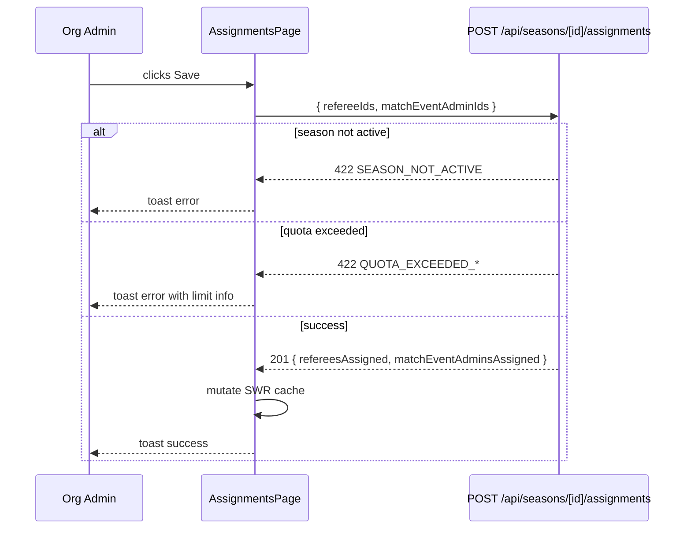
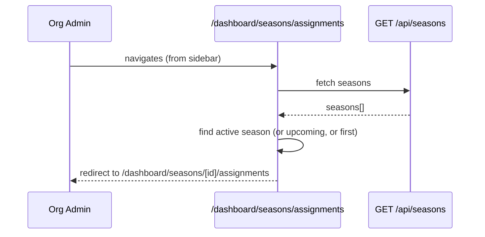

# Design Document: Season Assignments

## Overview

Org admins can assign Match Event Admins (MEAs) and Referees to active seasons, with quota enforcement based on `season.requiredClubs`. The feature adds backend validation to the existing POST endpoint, a new dedicated assignments page at `/dashboard/seasons/[id]/assignments`, a redirect entry point at `/dashboard/seasons/assignments`, and a sidebar link for org admins.

The design follows the existing patterns in the codebase: SWR for data fetching, shadcn/ui components, the `assertOrgScope` guard for authorization, and the squad-management redirect pattern for the entry point.

## Architecture

```mermaid
graph TD
    Sidebar -->|org admin link| RedirectPage[/dashboard/seasons/assignments]
    RedirectPage -->|fetches active season, redirects| AssignmentsPage[/dashboard/seasons/id/assignments]
    AssignmentsPage -->|GET| GetAssignments[GET /api/seasons/id/assignments]
    AssignmentsPage -->|GET| GetReferees[GET /api/referees]
    AssignmentsPage -->|GET| GetUsers[GET /api/users]
    AssignmentsPage -->|POST| PostAssignments[POST /api/seasons/id/assignments]
    PostAssignments -->|validates| SeasonReferee[(SeasonReferee)]
    PostAssignments -->|validates| UserRoleScope[(UserRoleScope)]
```

## Components and Interfaces

### Backend: POST /api/seasons/[id]/assignments (validation layer)

**Purpose**: Enforce active-season and quota constraints before persisting assignments.

**Interface**:
```typescript
// Request body (unchanged)
interface AssignmentBody {
  refereeIds: string[]
  matchEventAdminIds: string[]
}

// Success response (unchanged)
interface AssignmentResult {
  refereesAssigned: number
  matchEventAdminsAssigned: number
}

// 422 error response (new)
interface QuotaError {
  error: string           // human-readable message
  code: "SEASON_NOT_ACTIVE" | "QUOTA_EXCEEDED_REFEREES" | "QUOTA_EXCEEDED_MEAS"
  limit?: number          // the quota ceiling
  requested?: number      // what was requested
}
```

**Validation rules added**:
- `season.status !== "active"` → 422 `SEASON_NOT_ACTIVE`
- `season.requiredClubs !== null && refereeIds.length > 4 * requiredClubs` → 422 `QUOTA_EXCEEDED_REFEREES`
- `season.requiredClubs !== null && matchEventAdminIds.length > requiredClubs` → 422 `QUOTA_EXCEEDED_MEAS`
- Org scope check already exists (`assertOrgScope`) — no change needed

**Org-scoping for MEAs**: Before persisting, verify each `matchEventAdminId` has a `UserRoleScope` with `role.name = "match_event_admin"` and `organizationId` matching the season's org. Return 422 if any ID is out of scope.

### Frontend: /dashboard/seasons/assignments (redirect page)

**Purpose**: Entry point from sidebar. Mirrors `squad-management` — fetches org's seasons, redirects to the active one's assignments page.

**Interface**:
```typescript
// Fetches: GET /api/seasons (scoped by role — org admin sees their org's seasons)
// Redirects to: /dashboard/seasons/[activeSeasonId]/assignments
// Falls back to: first upcoming, then first season in list
```

### Frontend: /dashboard/seasons/[id]/assignments (main page)

**Purpose**: Two-panel UI for managing MEA and Referee assignments for a season.

**Interface**:
```typescript
interface AssignmentsPageProps {
  params: { id: string }  // seasonId
}

// Local state
interface AssignmentsState {
  pendingRefereeIds: string[]       // working copy, initialized from current assignments
  pendingMEAIds: string[]           // working copy
  isDirty: boolean                  // true when pending differs from saved
  isSaving: boolean
  pickerOpen: "referees" | "meas" | null
}
```

**Data fetched**:
- `GET /api/seasons/[id]` — season metadata (name, status, requiredClubs)
- `GET /api/seasons/[id]/assignments` — current referees + MEAs
- `GET /api/referees` — all referees (for picker)
- `GET /api/users` — org-scoped users (filter client-side for `match_event_admin` role)

**Quota display**: `"X / N assigned"` where N = `requiredClubs` (MEAs) or `4 * requiredClubs` (referees). When `requiredClubs` is null, show `"X assigned"` with no limit.

## Data Models

### Season (relevant fields)
```typescript
interface Season {
  id: string
  name: string
  status: "active" | "upcoming" | "completed"
  requiredClubs: number | null
  league: { id: string; name: string; organizationId: string; organization: { name: string } }
}
```

### Referee
```typescript
interface Referee {
  id: string
  firstName: string
  lastName: string
  licenseLevel: string | null
  nationality: string | null
  status: string
}
```

### MEA User
```typescript
interface MEAUser {
  id: string
  fullName: string
  email: string
  status: string
  userRoleScopes: Array<{ role: { name: string } }>
}
```

### Assignment response
```typescript
interface AssignmentResponse {
  referees: Referee[]
  matchEventAdmins: MEAUser[]
}
```

## Sequence Diagrams

### Save assignments flow



### Redirect entry point flow



## Error Handling

### SEASON_NOT_ACTIVE
- **Condition**: POST called on a season with `status !== "active"`
- **Response**: 422 `{ error: "Assignments can only be made to active seasons", code: "SEASON_NOT_ACTIVE" }`
- **Frontend**: toast.error with the message; Save button could also be disabled client-side when season is not active

### QUOTA_EXCEEDED_REFEREES
- **Condition**: `refereeIds.length > 4 * requiredClubs`
- **Response**: 422 `{ error: "Referee quota exceeded", code: "QUOTA_EXCEEDED_REFEREES", limit: 4 * requiredClubs, requested: refereeIds.length }`
- **Frontend**: toast.error showing "Max N referees allowed, you selected M"

### QUOTA_EXCEEDED_MEAS
- **Condition**: `matchEventAdminIds.length > requiredClubs`
- **Response**: 422 `{ error: "MEA quota exceeded", code: "QUOTA_EXCEEDED_MEAS", limit: requiredClubs, requested: matchEventAdminIds.length }`
- **Frontend**: toast.error showing "Max N MEAs allowed, you selected M"

### OUT_OF_SCOPE_MEA
- **Condition**: A `matchEventAdminId` does not belong to the org
- **Response**: 422 `{ error: "One or more MEAs do not belong to this organization", code: "OUT_OF_SCOPE_MEA" }`
- **Frontend**: toast.error

### No active season (redirect page)
- **Condition**: No seasons found or none active/upcoming
- **Response**: Show inline message "No active season found" instead of redirecting

## UI Layout

### Assignments page layout

```
┌─────────────────────────────────────────────────────────┐
│  ← Back   Season Name · Org · League        [active]    │
├──────────────────────────┬──────────────────────────────┤
│  Match Event Admins      │  Referees                    │
│  3 / 5 assigned          │  8 / 20 assigned             │
│  ┌────────────────────┐  │  ┌────────────────────────┐  │
│  │ Alice M.      [×]  │  │  │ John D.  FIFA L2  [×]  │  │
│  │ Bob K.        [×]  │  │  │ ...                    │  │
│  │ ...                │  │  └────────────────────────┘  │
│  └────────────────────┘  │  [+ Add Referee]             │
│  [+ Add MEA]             │                              │
├──────────────────────────┴──────────────────────────────┤
│                                          [Save Changes] │
└─────────────────────────────────────────────────────────┘
```

- Two `Card` components side by side (responsive: stacked on mobile)
- Quota indicator as `"X / N assigned"` text with a `Badge` turning amber when near limit, red when at/over
- Assigned list: each row has name + remove `×` button
- "Add" button opens a `Dialog` with a searchable list of available (unassigned) people
- "Save Changes" button at the bottom, disabled when `!isDirty || isSaving`
- When `season.status !== "active"`, show a warning banner and disable Save

### Sidebar addition

In `roleNavItems` inside `components/dashboard/sidebar.tsx`, add for `isOrgAdmin()`:

```typescript
...(isOrgAdmin()
  ? [
      { title: "Assignments", href: "/dashboard/seasons/assignments", icon: ClipboardCheck },
    ]
  : []),
```

## Testing Strategy

### Unit Testing Approach

Test the quota validation logic in isolation:
- `requiredClubs = null` → no quota enforced regardless of array lengths
- `requiredClubs = 5` → max 5 MEAs, max 20 referees
- Boundary: exactly at quota → allowed; one over → rejected

### Property-Based Testing Approach

**Property Test Library**: fast-check

Properties to verify:
- For any `requiredClubs > 0`, assigning exactly `requiredClubs` MEAs always succeeds (quota boundary)
- For any `requiredClubs > 0`, assigning `requiredClubs + 1` MEAs always returns 422
- For any `requiredClubs > 0`, assigning exactly `4 * requiredClubs` referees always succeeds
- For any `requiredClubs > 0`, assigning `4 * requiredClubs + 1` referees always returns 422
- When `requiredClubs = null`, any number of MEAs/referees is accepted

### Integration Testing Approach

- POST to inactive season → 422 SEASON_NOT_ACTIVE
- POST with valid IDs to active season with `requiredClubs = null` → 201
- POST with IDs exceeding quota → 422 with correct `limit` and `requested` fields
- GET after POST → returned arrays match what was posted

## Dependencies

- Existing: `prisma`, `@/lib/auth`, `@/lib/api-helpers`, `@/lib/scope-guard`
- Frontend: `swr`, `sonner` (toast), shadcn/ui (`Card`, `Badge`, `Button`, `Dialog`, `Skeleton`, `Tabs`)
- No new packages required
